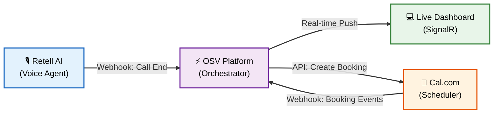
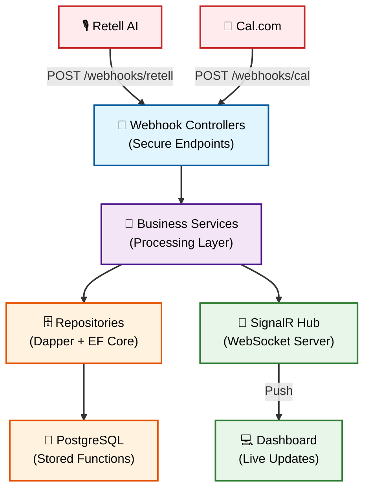
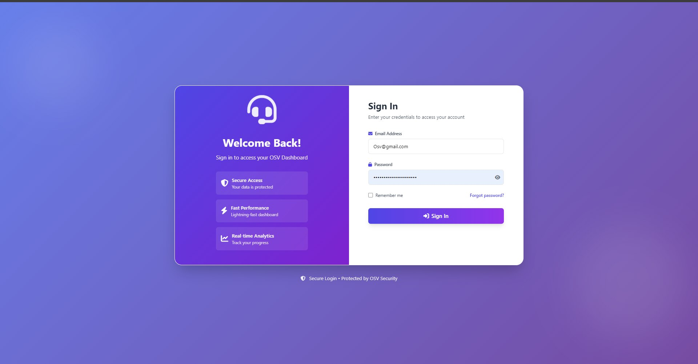
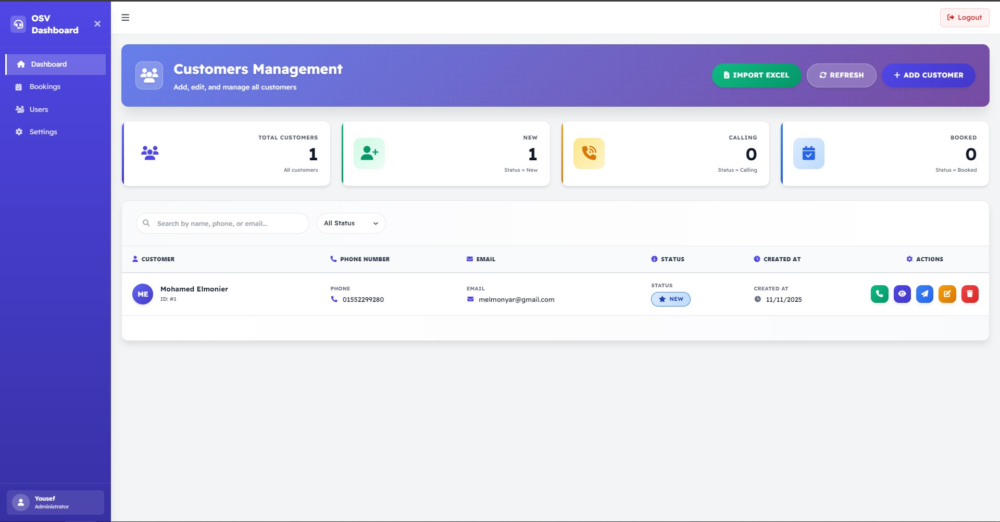
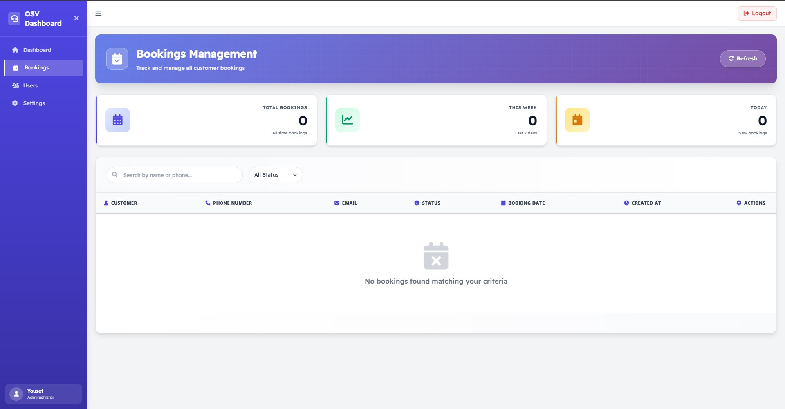
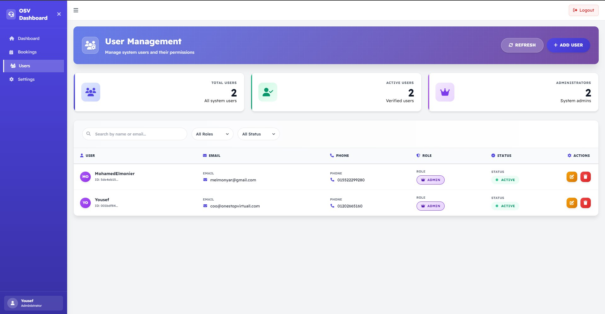
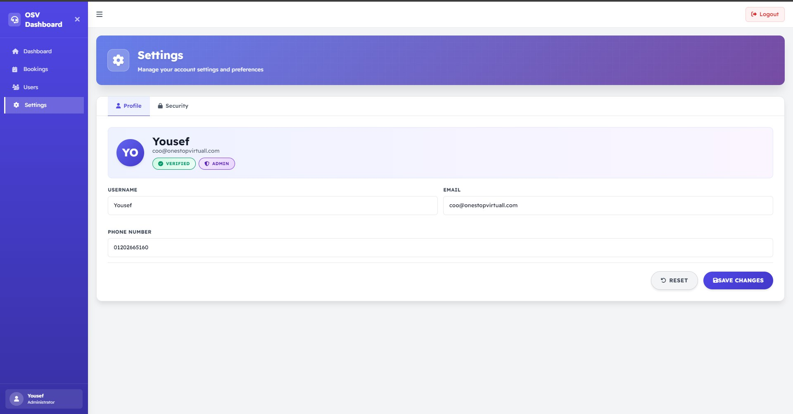
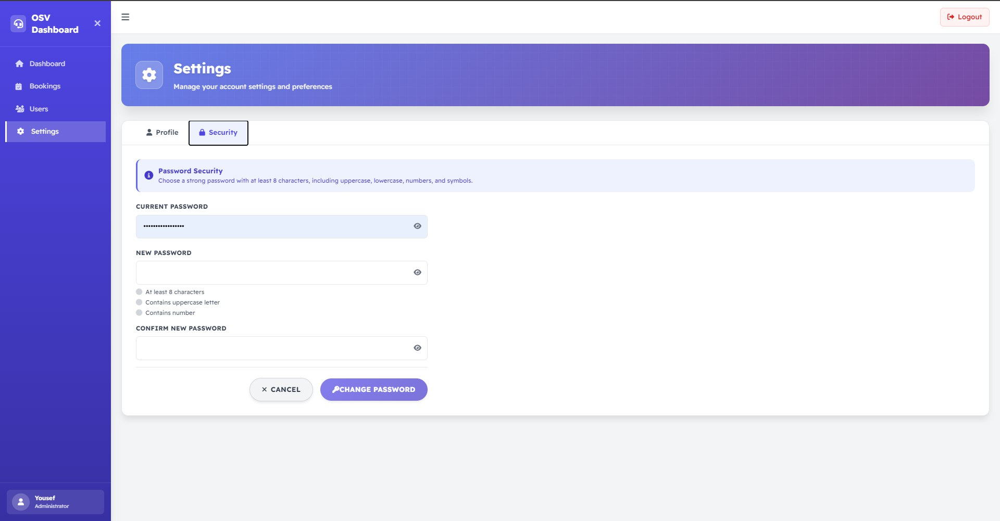
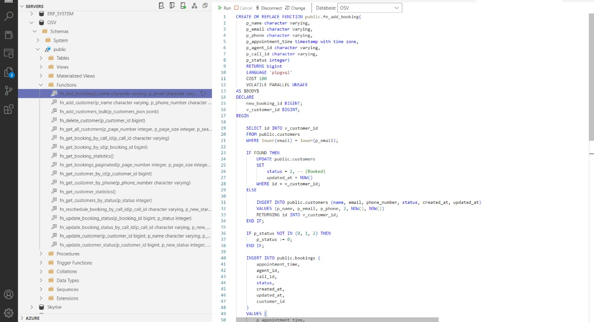
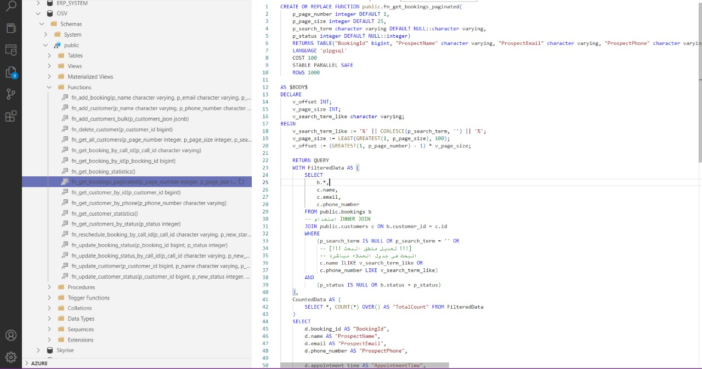

<div align="center">

# 🎙️ OSV - AI VOICE ORCHESTRATOR


<h3>⚡ Production-Ready AI Voice Agent Platform</h3>
<h4>Orchestrating Retell AI, Cal.com & CRM in Real-Time</h4>

> 🎯 **A high-performance bridge between Generative Voice AI and Business Operations**
> 
> 🔄 Event-driven architecture powering automated customer interactions at scale

[**🌟 Features**](#-key-capabilities--engineering-excellence) • [**🏗 Architecture**](#-system-architecture) • [**⚡ Quick Start**](#-getting-started)

---

</div>

## 📋 Table of Contents

- [🌟 Overview](#-overview)
- [🎯 Business Capabilities](#-business-capabilities)
- [🚀 Engineering Excellence](#-key-capabilities--engineering-excellence)
- [🛠 Technology Stack](#-technology-stack)
- [🏗 Architecture](#-system-architecture)
- [💻 Code Highlights](#-code-highlights)
- [⚡ Getting Started](#-getting-started)
- [👨‍💻 Author](#-author)

<br/>

---

## 🌟 Overview

<div align="center">

**OSV (Outbound Sales Voice)** is a **real-time AI orchestration platform** that seamlessly connects Voice AI agents with business-critical systems.

It acts as the **intelligent middleware** between customer conversations and backend operations.

</div>

<br/>

This system demonstrates advanced **event-driven architecture** and **real-time communication** patterns, showcasing expertise in building scalable, secure, and highly responsive enterprise integrations.

<br/>

### 💡 The Challenge It Solves

<table>
<tr>
<td width="33%">

#### 🤖 AI Voice Agents
Retell AI handles customer conversations, but needs a brain to process outcomes and trigger actions.

</td>
<td width="33%">

#### 📅 Automated Scheduling
Cal.com manages appointments, but requires bidirectional sync with CRM systems.

</td>
<td width="33%">

#### ⚡ Real-Time Updates
Sales teams need instant visibility without manual refreshes or polling.

</td>
</tr>
</table>

<div align="center">

**OSV solves this by acting as the central nervous system** - receiving webhooks, processing business logic in PostgreSQL, and pushing live updates via SignalR.

</div>

<br/>

---

## 🎯 Business Capabilities

<div align="center">

| Module | Core Features |
|:------:|:-------------|
| **🎙️ Voice AI Integration** | `Webhook Processing` • `Call Outcome Capture` • `Customer Intent Analysis` • `Metadata Extraction` |
| **📅 Smart Scheduling** | `Bi-directional Cal.com Sync` • `Automated Booking` • `Reschedule Handling` • `Cancellation Management` |
| **📊 Live Dashboard** | `Real-Time Updates (SignalR)` • `Customer Status Tracking` • `Booking Confirmations` • `Zero-Refresh UI` |
| **🔐 Enterprise Security** | `Timing-Attack Safe Auth` • `Webhook Signature Validation` • `API Key Management` • `Audit Logging` |

</div>

<br/>

---

## 🚀 Key Capabilities & Engineering Excellence

<br/>

### 🎯 **Event-Driven Real-Time Architecture**



<br/>

### ⚡ **Performance & Security at Scale**

<div align="center">

| Feature | Implementation | Benefit |
|---------|---------------|---------|
| **🛡️ Timing-Attack Safe Auth** | `CryptographicOperations.FixedTimeEquals` | Prevents side-channel attacks on API keys |
| **⚡ Logic in Database** | PostgreSQL Stored Functions via Dapper | Sub-millisecond business logic execution |
| **🔄 Hybrid ORM Strategy** | EF Core (Identity) + Dapper (Transactions) | Best of both worlds: convenience + speed |
| **📡 Zero-Latency Updates** | SignalR WebSockets | Instant UI updates without polling |

</div>

<br/>

### 🏗 **Advanced Integration Patterns**

<details>
<summary><b>🔍 Click to expand Integration Details</b></summary>

<br/>

#### **Retell AI Voice Integration**
- Secure webhook endpoint with custom authentication middleware
- Real-time capture of call metadata: duration, outcome, customer sentiment
- Automatic customer status updates based on AI conversation analysis
- Structured logging of all voice interactions for compliance

#### **Cal.com Bidirectional Sync**
- Handles `BOOKING_CREATED`, `RESCHEDULED`, `CANCELLED` webhook events
- Validates webhook signatures to ensure data integrity
- Automatic CRM status updates when appointments are confirmed
- Conflict resolution for concurrent booking modifications

#### **SignalR Real-Time Push**
- Dedicated Hub for broadcasting booking events to connected clients
- Role-based filtering: agents only see their own customers
- Automatic reconnection handling for network interruptions
- Efficient message serialization for minimal bandwidth usage

</details>

<br/>

### 🎨 **Modern Frontend Architecture**

<table>
<tr>
<td width="50%">

**🎨 Tailwind CSS Integration**
- Custom NPM build pipeline integrated with ASP.NET Core MVC
- Just-in-Time compilation for minimal CSS bundle size
- Responsive design system with dark mode support

</td>
<td width="50%">

**⚡ JavaScript Modules**
- ES6+ modern JavaScript architecture
- Modular SignalR connection management
- Lightweight DOM manipulation without jQuery

</td>
</tr>
</table>

<br/>

---

## 🛠 Technology Stack

### **🎯 Backend Framework**

<div align="center">


</div>

### **💾 Database & Data Access**

<div align="center">


</div>

### **☁️ Cloud & External Services**

<div align="center">


</div>

### **🎨 Frontend Stack**

<div align="center">


</div>

### **📚 Key Libraries**

<div align="center">

**Backend:** Serilog (Structured Logging) • FluentValidation • AutoMapper  
**Security:** System.Security.Cryptography • JWT Authentication  
**DevOps:** Docker Support • Health Checks

</div>

---

## 🏗 System Architecture

<div align="center">

### High-Level Component Diagram



</div>

### **📋 Layer Responsibilities**

<table>
<tr>
<td width="25%" align="center">

**🌐 Webhooks**
Secure endpoints

Signature validation

Event routing

</td>
<td width="25%" align="center">

**💼 Business Logic**
Process events

Validate data

Trigger actions

</td>
<td width="25%" align="center">

**🗄️ Data Access**
Execute SQL functions

Manage transactions

Audit logging

</td>
<td width="25%" align="center">

**📡 Real-Time**
SignalR broadcasting

Client notifications

Connection management

</td>
</tr>
</table>

---

## 💻 Code Highlights

### 🛡️ **Timing-Attack Safe Webhook Authentication**

One of the most critical security implementations - preventing side-channel attacks on API key validation:

```csharp
// Located in: Attributes/ApiKeyAuthAttribute.cs
public class ApiKeyAuthAttribute : Attribute, IAsyncActionFilter
{
    private const string API_KEY_HEADER = "X-API-Key";
    
    public async Task OnActionExecutionAsync(
        ActionExecutingContext context, 
        ActionExecutionDelegate next)
    {
        if (!context.HttpContext.Request.Headers.TryGetValue(API_KEY_HEADER, out var extractedApiKey))
        {
            context.Result = new UnauthorizedResult();
            return;
        }

        var validApiKey = context.HttpContext.RequestServices
            .GetRequiredService<IConfiguration>()
            .GetValue<string>("ApiKeys:Retell");

        // 🔒 CRITICAL: Using fixed-time comparison to prevent timing attacks
        var validApiKeyBytes = Encoding.UTF8.GetBytes(validApiKey);
        var extractedApiKeyBytes = Encoding.UTF8.GetBytes(extractedApiKey);

        if (!CryptographicOperations.FixedTimeEquals(validApiKeyBytes, extractedApiKeyBytes))
        {
            context.Result = new ContentResult() 
            { 
                StatusCode = 401, 
                Content = "Unauthorized" 
            };
            return;
        }

        await next();
    }
}
```

**Why This Matters:**
- Standard `string == string` comparison leaks timing information
- Attackers can use timing differences to brute-force API keys character by character
- `FixedTimeEquals` ensures constant-time comparison regardless of input
<br/>

## 📸 Preview

<div align="center">
    

<br/>

<br/>

<br/>

<br/>

<br/>

<br/>

</div>
---

### ⚡ **High-Performance Database Access with Dapper**

Business-critical operations executed via stored functions for atomicity and speed:

<div align="center">
    

<br/>

<br/>

</div>

**Benefits:**
- **Atomicity:** All validation and insert logic in a single transaction
- **Performance:** No ORM overhead, direct SQL execution
- **Maintainability:** Business rules live in version-controlled SQL functions
---

### 📡 **Real-Time Updates with SignalR**

Pushing booking confirmations to connected clients instantly:

```csharp
// Located in: Hubs/BookingHub.cs
public class BookingHub : Hub
{
    public async Task NotifyBookingCreated(BookingNotification notification)
    {
        // 📡 Broadcast to all connected clients in real-time
        await Clients.All.SendAsync("BookingCreated", notification);
    }

    public async Task NotifyStatusChanged(long bookingId, string newStatus)
    {
        await Clients.All.SendAsync("BookingStatusChanged", new 
        { 
            BookingId = bookingId, 
            Status = newStatus,
            Timestamp = DateTime.UtcNow
        });
    }
}

// Usage in Service Layer
public class BookingService
{
    private readonly IHubContext<BookingHub> _hubContext;

    public async Task ProcessCalComWebhook(CalComWebhookPayload payload)
    {
        // ... business logic ...

        // ⚡ Push update to dashboard instantly
        await _hubContext.Clients.All.SendAsync("BookingCreated", new
        {
            CustomerName = payload.BookeeName,
            BookingTime = payload.StartTime,
            Status = "Confirmed"
        });
    }
}
```

---

### 🎨 **Modern Frontend with Tailwind CSS**

Custom build pipeline integrated with ASP.NET Core:

```json
// package.json
{
  "scripts": {
    "css:build": "npx tailwindcss -i ./wwwroot/css/input.css -o ./wwwroot/css/output.css --minify",
    "css:watch": "npx tailwindcss -i ./wwwroot/css/input.css -o ./wwwroot/css/output.css --watch"
  },
  "devDependencies": {
    "tailwindcss": "^3.4.0"
  }
}
```

```javascript
// tailwind.config.js
module.exports = {
  content: [
    './Views/**/*.cshtml',
    './Pages/**/*.cshtml',
    './wwwroot/js/**/*.js'
  ],
  theme: {
    extend: {
      colors: {
        'brand-primary': '#6366f1',
        'brand-secondary': '#8b5cf6'
      }
    }
  }
}
```

**Result:** Production-ready, responsive UI with minimal CSS footprint (< 20KB gzipped)

---

## ⚡ Getting Started

### 📋 Prerequisites

```bash
# Required Software
- .NET 10 SDK
- PostgreSQL 17
- Node.js 18+ (for Tailwind CSS build)
- Docker (optional, for containerized deployment)
```

### 🚀 Installation Steps

#### **1️⃣ Clone the Repository**

```bash
git clone https://github.com/MohamedElmonyar/OSV-AI-Orchestrator.git
cd OSV-AI-Orchestrator
```

#### **2️⃣ Database Setup**

```bash
# Connect to your PostgreSQL instance
psql -U postgres -d osv_db

# Run the schema script
\i OSV_Schema.sql

# Verify tables and functions
\dt
\df
```

#### **3️⃣ Configure Application**

Update `appsettings.json` with your credentials:

```json
{
  "ConnectionStrings": {
    "DefaultConnection": "Host=localhost;Database=osv_db;Username=postgres;Password=yourpassword"
  },
  "ApiKeys": {
    "Retell": "your-retell-api-key",
    "CalCom": "your-calcom-secret"
  },
  "AWS": {
    "AccessKey": "your-aws-access-key",
    "SecretKey": "your-aws-secret-key",
    "Region": "us-east-1"
  }
}
```

#### **4️⃣ Build Frontend Assets**

```bash
cd OSV_Project/OSV
npm install
npm run css:build
```

#### **5️⃣ Run the Application**

```bash
# Development mode
dotnet run

# Production mode
dotnet run --configuration Release
```

### 🐳 **Docker Deployment (Optional)**

```bash
# Build and run with Docker Compose
docker-compose up -d

# View logs
docker-compose logs -f osv-app

# Stop services
docker-compose down
```

---

## 📁 Project Structure

```
OSV-AI-Orchestrator/
│
├── 📂 OSV_Project/
│   └── 📂 OSV/                          # Main Application
│       ├── Controllers/                 # 🌐 Webhook & Dashboard Controllers
│       │   ├── WebhookController.cs     # Retell/Cal.com endpoints
│       │   └── BookingController.cs     # Dashboard API
│       │
│       ├── Hubs/                        # 📡 SignalR Hubs
│       │   └── BookingHub.cs            # Real-time notifications
│       │
│       ├── Services/                    # 💼 Business Logic Layer
│       │   ├── RetellService.cs
│       │   ├── CalComService.cs
│       │   └── BookingService.cs
│       │
│       ├── Data.Access/                 # 🗄️ Repository Layer
│       │   ├── IBookingRepository.cs
│       │   └── BookingRepository.cs     # Dapper implementation
│       │
│       ├── Attributes/                  # 🛡️ Custom Middleware
│       │   └── ApiKeyAuthAttribute.cs   # Timing-safe auth
│       │
│       ├── Views/                       # 🎨 Razor Pages
│       │   ├── Dashboard/
│       │   └── Shared/
│       │
│       ├── wwwroot/                     # 📦 Static Assets
│       │   ├── css/
│       │   │   ├── input.css            # Tailwind source
│       │   │   └── output.css           # Compiled CSS
│       │   └── js/
│       │       └── signalr-client.js    # SignalR connection
│       │
│       ├── appsettings.json             # ⚙️ Configuration
│       ├── Program.cs                   # 🚀 Application Startup
│       ├── package.json                 # 📦 NPM dependencies
│       └── tailwind.config.js           # 🎨 Tailwind config
│
│
├── 🐳 Dockerfile
├── 🐳 docker-compose.yml
└── 📖 README.md
```

---

## 🔐 Security Considerations

<div align="center">

| Security Layer | Implementation | Protection Against |
|---------------|---------------|---------------------|
| **API Authentication** | Timing-Attack Safe Comparison | Brute-force attacks, Side-channel attacks |
| **Webhook Validation** | HMAC Signature Verification | Request forgery, Man-in-the-middle |
| **Data Encryption** | TLS 1.3 (HTTPS Only) | Eavesdropping, Packet sniffing |
| **SQL Injection** | Parameterized Queries (Dapper) | SQL injection attacks |
| **Rate Limiting** | ASP.NET Core Middleware | DDoS, API abuse |

</div>

---

## 📊 Performance Metrics

<div align="center">

```
⚡ Webhook Processing: < 50ms (95th percentile)
📡 SignalR Message Delivery: < 100ms (real-time)
🗄️ Database Query Execution: < 5ms (stored functions)
🎨 Page Load Time: < 1.2s (Lighthouse Score: 95+)
```

</div>

<div align="center">

## 👨‍💻 Author

### **Mohamed Elmonier**

*Backend Developer | .NET Specialist*

[](https://github.com/MohamedElmonyar)
[]((https://www.linkedin.com/in/mohamed-elmonyar/))

---

### 🎙️ **Built with ASP.NET Core 10 & Real-Time Engineering**

*A showcase of event-driven architecture, secure webhook processing, and modern full-stack development.*

*Demonstrating expertise in building production-ready AI integration platforms.*

---

### 📬 Interested in a Live Demo?

This platform is actively used in production environments. I'm available to:

- 🎥 **Walk through the architecture** in a live session
- 📄 **Share specific implementation details** for webhooks/SignalR
- 💬 **Discuss design decisions** and trade-offs

📧 **Contact:** mohamed.elmonyar@example.com

</div>

---

<div align="center">

**⭐ If you find this project interesting, please consider starring the repository!**

*Last Updated: January 2025*

</div>
